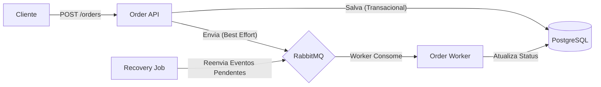

# 🚚 Sistema de Processamento de Pedidos (Event-Driven)

API REST desenvolvida para o gerenciamento de pedidos, com foco em **resiliência**, **baixa latência**, **consistência de dados** e processamento **orientado a eventos**.

<p align="center">
  
  
  
  
  
</p>

---

# 📖 Visão Geral

Este sistema implementa um fluxo orientado a eventos, projetado para:

- Baixa latência  
- Consistência forte  
- Resiliência a falhas  
- Auto-recuperação  
- Desacoplamento entre recepção e processamento  

A API cria pedidos e publica eventos no **RabbitMQ**, onde um Worker consome e atualiza o status do pedido de forma assíncrona.

---

# 🏗 Arquitetura



### 🔄 Fluxo de Dados Detalhado

1.  **Recebimento:** A API recebe a requisição de criação de pedido.
2.  **Persistência Atômica:** O pedido (tabela `orders`) e o evento de criação (tabela `order_events`) são salvos na mesma transação de banco de dados. Isso garante atomicidade: ou tudo é salvo, ou nada é salvo.
3.  **Propagação (Best Effort):** O sistema tenta enviar o evento para o RabbitMQ imediatamente após o commit no banco.
4.  **Processamento Assíncrono:** Um consumidor (Worker) lê a fila e atualiza o status do pedido no banco até a entrega final (`DELIVERED`).

---

## 🧠 Estratégias de Engenharia

Para atender aos requisitos técnicos rigorosos, foram adotadas as seguintes estratégias:

### 1. Garantia de Consistência Total (Transactional Outbox Simplificado)
* **Desafio:** O problema de *Dual Write* (escrever no banco e na fila simultaneamente corre o risco de falha em um dos lados, gerando inconsistência).
* **Solução:** Utilizei a tabela `order_events` como controle de estado. Todo evento é persistido com o status `sent = false` dentro da transação do pedido.
* **Resultado:** Se a aplicação cair logo após salvar no banco (e antes de enviar para a fila), o evento continua salvo e seguro no banco de dados.

### 2. Resiliência e Auto-Recuperação (Self-Healing)
* **Desafio:** O que acontece se o RabbitMQ estiver fora do ar?
* **Solução:** O sistema implementa um mecanismo de *Fallback*.
    * Se o RabbitMQ cair, a API continua aceitando pedidos normalmente (Status 201), mas os eventos ficam marcados como pendentes.
    * Um **Job Agendado** (`EventPublisherJob`) roda a cada 10 segundos, busca eventos não enviados (`sent = false`) e tenta reenviá-los.
    * Assim que o RabbitMQ volta, o fluxo se normaliza sem intervenção humana.

### 3. Baixa Latência (Best Effort Delivery)
* **Desafio:** Não penalizar o usuário esperando o Job rodar para processar o pedido.
* **Solução:**
    * A aplicação tenta enviar a mensagem para a fila imediatamente após o commit no banco (bloco `try-catch`).
    * Se o RabbitMQ estiver online, o evento é processado em milissegundos. O Job atua apenas como uma "rede de segurança".

---

## 🛠️ Tecnologias Utilizadas

| Tecnologia | Justificativa |
| :--- | :--- |
| **Java 17 + Spring Boot 3** | Plataforma robusta, moderna e com excelente ecossistema para microsserviços e integração com mensageria (Spring AMQP). |
| **PostgreSQL** | Banco relacional ACID para garantir a integridade dos dados críticos (Pedidos) e Histórico de Eventos. |
| **RabbitMQ** | Broker de mensagens maduro e amplamente utilizado para desacoplar a recepção do pedido do processamento. |
| **Docker & Compose** | Garante que a aplicação rode da mesma forma na máquina do desenvolvedor e no servidor ("Plug and Play"). |
| **Testcontainers** | Utilizado nos testes de integração para subir containers reais do banco e fila, garantindo validação em ambiente real (sem mocks de infra). |
| **Lombok** | Redução de código repetitivo (boilerplate), focando na regra de negócio. |

---

## 🚀 Como Executar

### Pré-requisitos
* Docker e Docker Compose instalados.
* Java 17 e Maven (opcional, caso queira rodar fora do Docker).
* Se quiser subir rabbit, postgree e java, só descomentar o app no arquivo compose.yaml
* O docker sobe o postgree na porta 5432 e o rabbit na 5672/15672 

### Passo a Passo

1.  Subir a infraestrutura (RabbitMQ e PostgreSQL):
    ```bash
    docker-compose up -d
    ```

2.  Executar a aplicação:
    ```bash
    ./mvnw spring-boot:run
    ```

---

## 🔗 Endpoints Principais

| Método | Rota | Descrição | Exemplo de Body |
| :--- | :--- | :--- | :--- |
| `POST` | `/api/orders` | Cria um novo pedido e inicia o fluxo. | `{ "customerId": "user_123" }` |
| `GET` | `/api/orders/{id}` | Consulta o status atual do pedido. | - |
| `GET` | `/api/orders/{id}/events` | Consulta o histórico de eventos (Auditoria). | - |

